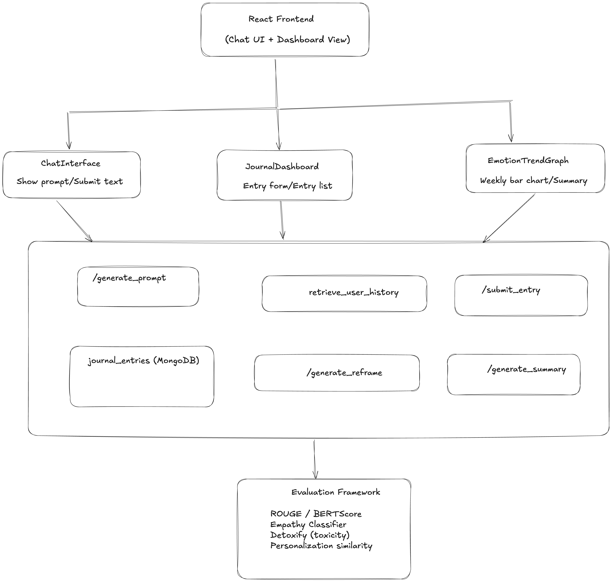

## Design Overview – Journaling Companion

### Objective
Create an AI-powered journaling assistant that is:
- **Private**: No sensitive user data is shared externally
- **Empathetic**: Tone-safe, gentle outputs
- **Insightful**: Summarizes patterns and emotional trends
- **Personalized**: Prompt generation adapts to past history

---

## Architecture

### 🗂️ Backend (FastAPI + MongoDB)
- Stores journal entries, summaries, emotion tags
- Routes: `/submit_entry`, `/get_entries`, `/generate_prompt`, `/generate_summary`, `/generate_reframe`

### AI/ML Layer
- GPT-4 via OpenAI (for generation tasks)
- Sentence-BERT + FAISS for retrieval and clustering
- HuggingFace fine-tuned classifier for emotion tagging

### Evaluation Pipeline
- Empathy classifier + Detoxify for reframe validation
- ROUGE + BERTScore for summaries
- Cosine sim for personalization

### Frontend (React)
- Chat-like interface for prompt and response
- Dashboard with trend graph, entry input, history

---

## Workflow

1. **User logs entry** via prompt → saved to DB
2. **Emotion classifier** labels it
3. **Reframing generator** returns encouragement (optional)
4. **Prompt generator** fetches past 3 entries via FAISS → GPT-4 prompt
5. **Weekly summary** aggregates entries, clusters by topic, GPT-4 summarizes
6. **Dashboard** shows trend, prompt, past entries

---

## Modules

| Module            | Status     | Notes                          |
|------------------|------------|--------------------------------|
| Prompt Generator | ✅ Ready   | GPT-4 + RAG                    |
| Emotion Classifier | ✅ Ready | DistilRoBERTa fine-tuned       |
| Reframer         | ✅ Ready   | GPT-4 with safety template     |
| Summarizer       | ✅ Ready   | Clustering + GPT-4             |
| Trend Visualizer | 🟡 UI Only | Uses `/get_summary` endpoint   |

---

## Deployment Plan
- Dockerized FastAPI + MongoDB backend
- React UI served via Nginx container
- Frontend/backend linked via proxy or shared compose network
- CI/CD optional via GitHub Actions

---

## Privacy
- No data stored outside project containers
- No user authentication yet (local only)
- Emotion tags + summaries remain private